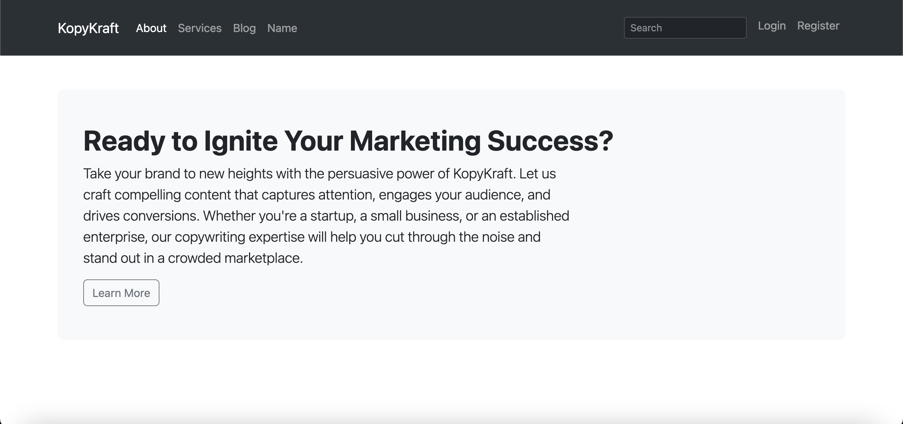
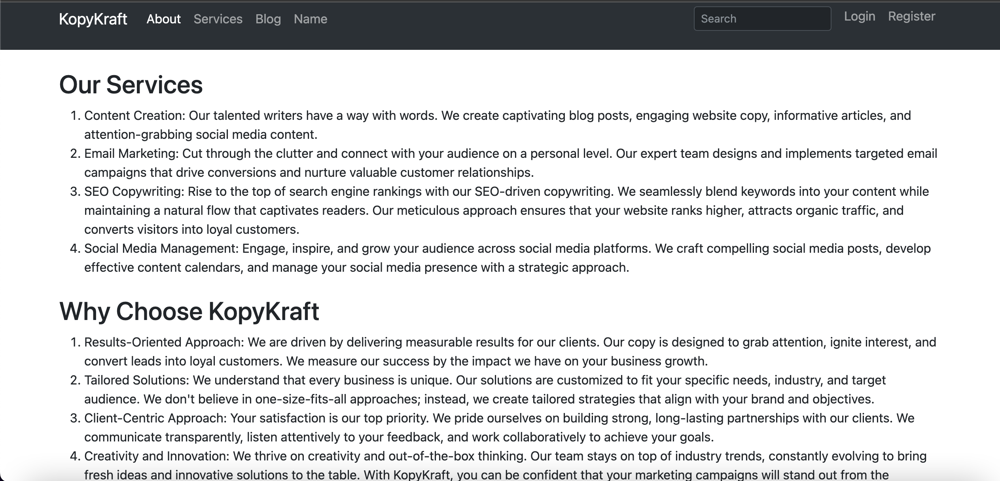
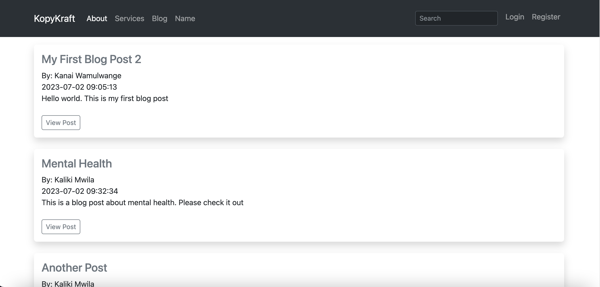
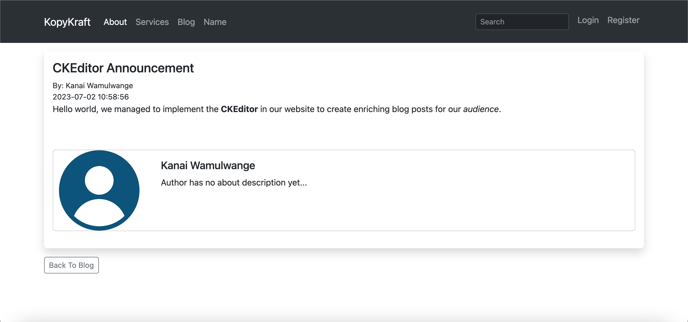
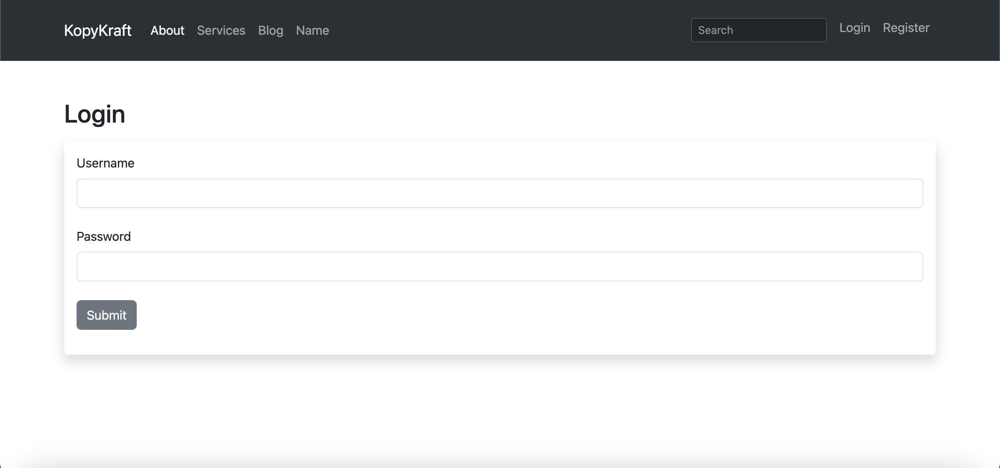
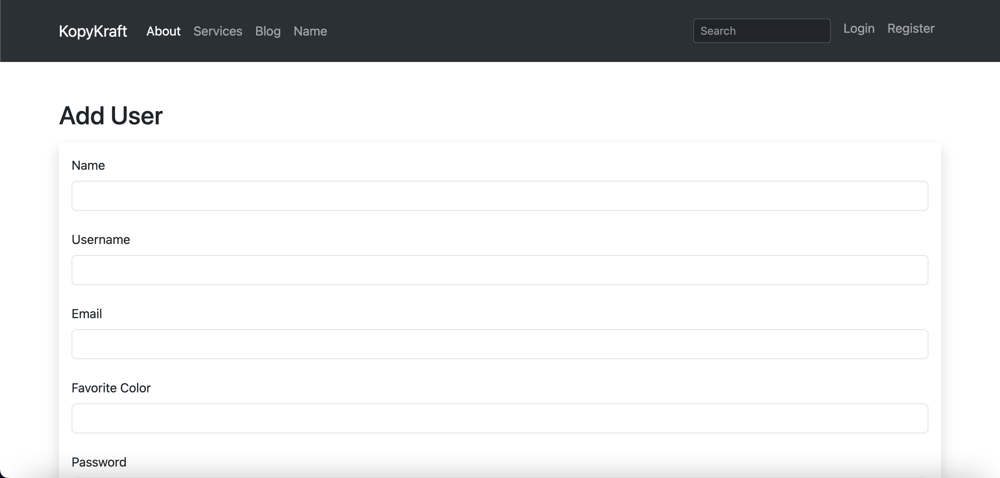
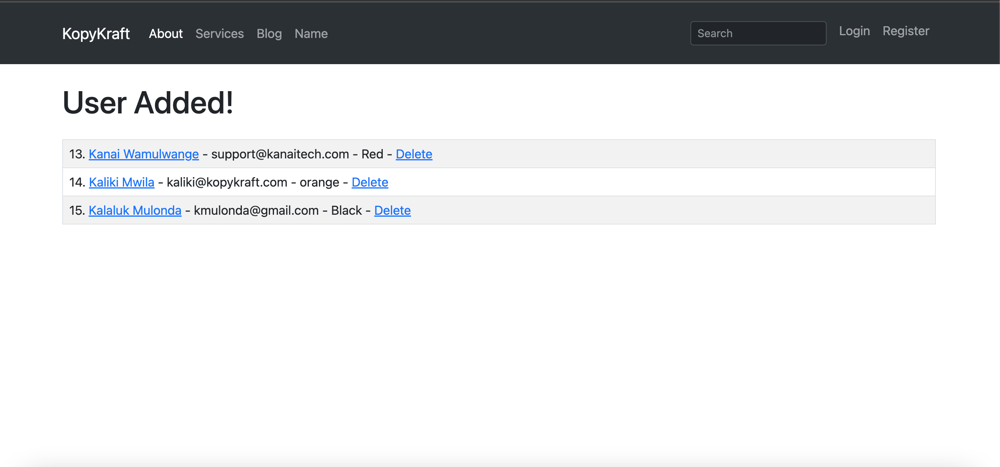
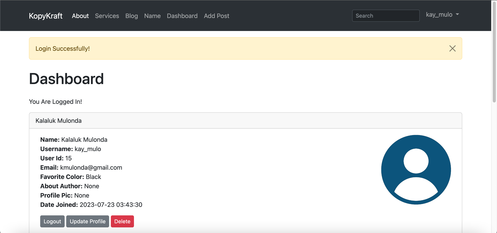
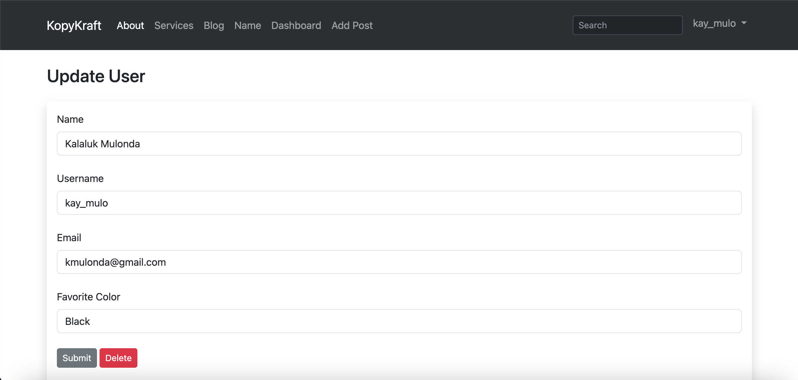
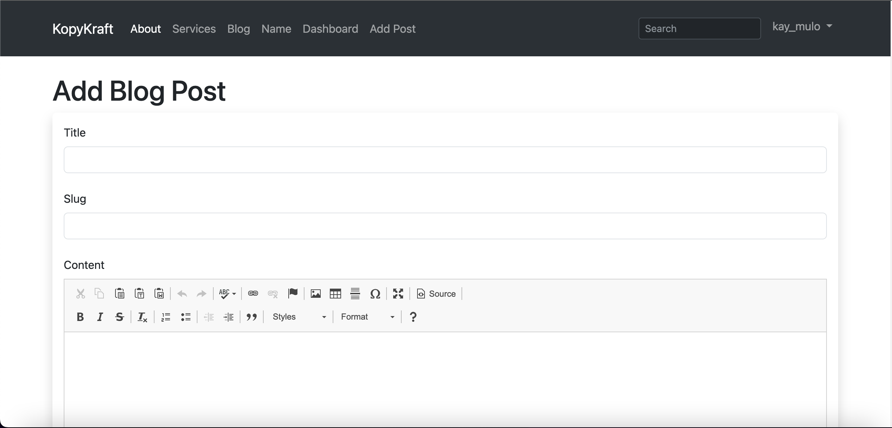

# Create A Flask Blog

This project provides a comprehensive guide on creating a flask blog application called Flasker. Users will be able to register, log in, create posts, and edit or delete their own posts.  You will learn a bit more advanced stuff like working with Web Forms (WTF), Flask Migration, Connecting to MySQL Database, integrating CKEditor and so much more.

<p>
  
</p>

<p>
  
</p>

<p>
  
</p>

<p>
  
</p>

<p>
  
</p>

<p>
  
</p>

<p>
  
</p>

<p>
  
</p>

<p>
  
</p>

<p>
  
</p>

<p>
  
</p>


**What You'll Learn**
```
1. Flask Setup & Installation
2. Jinja2 Templating Lanaguga
3. Custom Error Pages
4. Templates, Bootstrap Navbars, and Links
5. Web Forms With WTF
6. How to Use Messages
7. How to Use CSS, JavaScript & Images
8. How to Use Databases With SQLAlchemy
9. How to Use MySQL Database
10.Updating a Record In the Database
11.Migrating Database
12.Delete Database Records
13.Hashing Passwords With Werkzeug
14.Using Hashed Password For Registration
15.Comparing Hashed Passwords To Plaintext Passwords
16.How to Return JSON With Flask For an API
17.Add A Blog Post Model and Form
18.Show Blog Posts Page
19.Individual Blog Post Pages
```

## 1. Flask Setup & Installation

`$ mkdir flask-website`

`$ cd flask-website`

`$ pipenv shell`

`$ pipenv install flask flask-login Flask-SQLAlchemy python-dotenv`

`$ export FLASK_ENV=development`

`$ export FLASK_APP=app.py`

`$ flask run`

## 2. Jinja2 Templating Language

**Filters**
```
1. safe
2. capitalize
3. lower
4. upper
5. title
6. trim
7. striptags
```

## 3. Custom Error Pages and Version Control

```
from flask import Flask

# Create Custom Error Pages
# Invalid URL
@app.errorhandler(404)
def page_not_found(e):
    return render_template('404.html'), 404

# Internal Server Error
@app.errorhandler(500)
def internal_server_error(e):
    return render_template('500.html'), 500
```

## 4. Templates, Bootstrap Navbars and Links

## 5. Web Forms with WTF

**What You'll Learn**
```
1. pip install flask-wtf
2. import WTF
3. Create a Secret Key
4. Create Form Class
5. Create profile/name.html
6. Create route for name.html
7. Add Link to name.html in Navbar
8. Add Bootstrap to Form
9. Change Btn Color
10.List of WTF fields and Validators
11.Check out Flask WTF Documentation
```

`$ pipenv install flask-wtf`

```
from flask_wtf import FlaskForm
from wtforms import StringField, SubmitField
from wtforms.validators import DataRequired

# Create a Form Class
class NamerForm(FlaskForm):
    name = StringField("What's Your Name", validators=[DataRequired()])
    submit = SubmitField("Submit")
    
# create name page
@app.route('/name', methods=['GET', 'POST'])
def name():
    name = None
    form = NamerForm()
    # validate form
    if form.validate_on_submit():
        name = form.name.data
        form.name.data = ''

    return render_template('profile/name.html',
                           name=name,
                           form=form)
```

```



    
        <h1 class="mt-4">Hello, {{ name|title }}</h1>
    
        <h1 class="mt-4">What's Your Name?</h1>
        <br />
        <form action="" method="POST">
            {{ form.hidden_tag() }}

            {{ form.name.label(class="form-label") }}
            {{ form.name(class="form-control shadow-none") }}
            <br />
            {{ form.submit(class="btn btn-secondary shadow-none") }}
        </form>
    

```

## 6. Flash Messages

**What You'll Learn**
```
1. Introduction
2. Import Flash to Our Project
3. Create Flash Message
4. Add Flash Message to Webpage
5. Style Flash Message with Bootstrap
6. Flash Message Alert Fade
7. Change Flash Message Bootstrap Alert Color
8. Add Flash Message to Index Page
9. Conclusion
```

## 7. Static Files [CSS, JavaScript and Images]

## 8. Using Databases with SQLAlchemy

**What You'll Learn**
```
1. Introduction
2. pip install flask-sqlalchemy
3. import flask-sqlalchemy to our flask app
4. Set SQLAlchemy DB URI for sqlite
5. Create Our Database Model
6. Import Model From Terminal
7. Create UserForm
8. Create Add Route
9. Create users/add_user.html
10.Add Link to add_user.html in Navbar
11.Set Form
12.Validate Form on Submit
13.Save Data to Database on Submit
14.Query Database And Output Users to Webpage
15.Style Form With Bootstrap
16.Add Users Table
17.Conclusion
```

```
>>> from app import db
>>> db.create_all()
>>> exit()
```

## 9. Using MySQL Database


**What You'll Learn**
```
1. Introduction
2. Download & Install MySQL
3. Set the Database URI for MySQL
4. pip install mysql connectors
5. Create the User Database
6. Import Database From Python Shell
7. Pip install PyMSQL and Cryptography
8. Update Database URI for PyMySQL
9. Test Our App
10.Conclusion
```

`$ mysql -u root -p`

`$ pip install mysql-connector`

`$ pip install mysql-connector-python`

`$ pip install mysql-connector-python-rf`

```
>>> db.create_all()
```

`$ pip install pymysql`

`$ pip install cryptography`

## 10. Updating a Record in the Database

**What You'll Learn**
```
1. Introduction
2. Create Update Route
3. Process Update Form
4. Create users/update.html webpage
5. Make Records Clickable to Update
6. Pre-populate Update Form with Record Info
7.Conclusion
```

# 11. How to Migrating Database with Flask

`$ pipenv install Flask-Migrate`

```
from flask_sqlalchemy import SQLAlchemy
from flask_migrate import Migrate
...


...
db = SQLAlchemy(app)
migrate = Migrate(app, db) # migrates our app with our database
...
```

```
$ flask db
$ flask db init # Creates a new migration repository.
$ flask db migrate -m 'Initial Migration'
$ flask db upgrade # Upgrade to a later version
$ flask run
```

# 12. Delete Database Records

# 16. How to Return JSON With Flask For an API

**What You'll Learn**
```
1. Introduction
2. Create JSON Route and Function
3. Import Date from Datetime
4. Return Python Dictionary into JSON
5. Test
6. Create a Engineers Dictionary
7. Return Engineers Dictionary as JSON
8. Conclusion
```

```
from datetime import datetime, date

# return json data
@app.route('/date')
def get_current_date():
    return {"Date": date.today()}

@app.route('/engineers')
def get_engineers():
    engineers = {
        "Kanai": "Frontend Engineer",
        "Peter": "Backend Engineer",
        "Katumbi": "Software Engineer",
        "Victor": "Cybersecurity",
    }

    return engineers
```

# 17. Add a Blog Post Model and Form

**What You'll Learn**
```
1. Introduction
2. Create Blog Post Model
3. Make Migration and Push Migration
4. Create Post Form
5. Import TextArea WTForms Widget
6. Create Post Page Route and Function
7. Clear the Form on Submit
8. Add Post to Database
9. Create a Flash Message on Submit and Return Webpage
10.Creae Add Post Template
11.Add Link to Navbar
12.Conclusion
```

```
# Create Blog Post Model
class Posts(db.Model):
    id = db.Column(db.Integer, primary_key=True)
    title = db.Column(db.String(255))
    content = db.Column(db.Text)
    author = db.Column(db.String(255))
    date_posted = db.Column(db.DateTime, default=datetime.utcnow)
    slug = db.Column(db.String(255))

# create post form
class PostForm(FlaskForm):
    title = StringField("Title", validators=[DataRequired()])
    content = StringField("Content", validators=[DataRequired()], widget=TextArea())
    author = StringField("Author", validators=[DataRequired()])
    slug = StringField("Slug", validators=[DataRequired()])
    submit = SubmitField("Submit")
```

```
# Add Post Page
@app.route('/add-post', methods=['GET', 'POST'])
def add_post():
    form = PostForm()

    if form.validate_on_submit():
        # get data from form
        title = form.title.data
        content = form.content.data
        slug = form.slug.data
        author = form.author.data

        # create new post
        post = Posts(title=title, content=content, slug=slug, author=author)

        # clear form
        form.title.data = ''
        form.content.data = ''
        form.author.data = ''
        form.slug.data = ''

        # Add post data to db
        db.session.add(post)
        db.session.commit()

        # Return a flash message
        flash("Blog Post Submitted Sucessfully!")
    
    # Return to the webpage
    return render_template("posts/create.html", form=form)
```

```


Add Post


    <!-- Form Fields -->
        <h1 class="mt-4">Add Blog Post</h1>
        <div class="shadow p-3 mb-5 bg-body rounded">
            <form action="" method="POST">
                {{ form.hidden_tag() }}

                {{ form.title.label(class="form-label") }}
                {{ form.title(class="form-control shadow-none") }}
                <br />

                {{ form.author.label(class="form-label") }}
                {{ form.author(class="form-control shadow-none") }}
                <br />

                {{ form.slug.label(class="form-label") }}
                {{ form.slug(class="form-control shadow-none") }}
                <br />

                {{ form.content.label(class="form-label") }}
                {{ form.content(class="form-control shadow-none", rows="5") }}
                <br />

                {{ form.submit(class="btn btn-secondary shadow-none") }}
            </form>
        </div>

```

# 18. Show All Blog Posts

**What You'll Learn**
```
1. Introduction
2. Create Posts Route
3. Create Posts Function/View
4. Create Posts Webpage
5. Create Link in Navbar
6. Query from DB and pass to webpage
7. For Loop Thru Posts on webpage
8. Add Style to Webpage
9. Conclusion
```

```
# Get All Blog Posts
@app.route('/posts')
def posts():
    # fetch all posts from database
    posts = Posts.query.order_by(Posts.date_posted)
    return render_template('posts/index.html', posts=posts)
```

# 19 Show Individual Blog Post Details

**What You'll Learn**
```
1. Introduction
2. Create Post Route
3. Create Post Function/View
4. Create Post Template
5. Add Link to Posts Page
6. Turn Link to Btn
7. Add Back to Posts Btn
8. Make Post Title Clickable
9. Conclusion
```

```
# Get Single Blog Post
@app.route('/posts/<int:id>')
def post(id):
    # fetch all posts from database
    post = Posts.query.get_or_404(id)
    return render_template('posts/post.html', post=post)
```

# 20. Edit Blog Post

**What You'll Learn**
```
1. Introduction
2. Create Edit Post Route
3. Create Edit Post Function/View
4. Validate Form Submission
5. Add Success Flash Message and Redirect
6. Pass Form Data to Page
7. Create Edit Post Template
8. Add Edit Post Link to Posts Page
9. Add Edit Post Link to Individual Post Page
10.Conclusion
```

```
# Edit Blog Post
@app.route('/posts/edit/<int:id>', methods=['GET', 'POST'])
def edit_post(id):
    post = Posts.query.get_or_404(id)
    form = PostForm()

    if form.validate_on_submit():
        post.title = form.title.data
        post.author = form.author.data
        post.slug = form.slug.data
        post.content = form.content.data

        # update database
        db.session.add(post)
        db.session.commit()
        flash('Post Update Successfully!')
        return redirect(url_for('post', id=id))
    
    form.title.data = post.title
    form.author.data = post.author
    form.slug.data = post.slug
    form.content.data = post.content
    
    return render_template('posts/edit.html', post=post, form=form)
```

# 22. Delete Blog Posts

**What You'll Learn**
```
1. Introduction
2. Create Delete Route
3. Create Delete Post Function/View
4. Flash Message and Redirect
5. Error Message
6. Add Delete Btn to Post Page
7. Add Delete Btn to Blog Page
8. Conclusion
```

```
# Delete Blog Post
@app.route('/posts/delete/<int:id>')
def delete_post(id):
    post = Posts.query.get_or_404(id)

    try:
        db.session.delete(post)
        db.session.commit()
        # return message
        flash('Blog Post Delete Successfully!')
        # get all post from database
        posts = Posts.query.order_by(Posts.date_posted)
        return render_template('posts/index.html', posts=posts)
    except:
        # return error message
        flash('Whoops! There was a problem when deleting the blog post, try again...')
        # get all post from database
        posts = Posts.query.order_by(Posts.date_posted)
        return render_template('posts/index.html', posts=posts)
```

# 23. User Login with Flask Login

**What You'll Learn**
```
1. Introduction
2. Pip install Flask Login
3. Import Flask Login to App
4. Add UserMixin to User Model
5. Add Username to User Model
6. Make DB Migration
7. Add Username Field to UserForm
8. Add Username Field to Webpage
9. Create Login Template
10.Create Dashboard Template
11.Create Login Route and View
12.Create Dashboard Route and view
13.Create Login Form
14.Add Link to Navbar
15.Add Flask Login Configuration
16.Login Manager . User Loader
17.Add @login_required to Dashboard Route
18.Validate Login Form
19.Check Password Hash
20.Show Flash Messages
21.Test
22.Create Logout Functionality
23.Add Logout Link to Navbar
24.Conclusion
```

# 24. Create A User Dashboard

**What You'll Learn**
```
1. Introduction
2. Modify Navbar is_authenticated
3. Only Register If Not Logged In
4. Add Dashboard Link to Navbar
5. Add User Info to Dashboard
6. Add Bootstrap Card to Dashboard
7. Conclusion
```

# 25. How to Lock Down Your Flask App

**What You'll Learn**
```
1. Introduction
2. Add @login_required to View
3. Add @login_required to Edit Post View
4. Check if User is authenticated to Add Post
5. Conclusion
```

# 26. Update User Profile From Dashboard

**What You'll Learn**
```
1. Introduction
2. Add Username to Update Page
3. Add Update Btn to Dashboard
4. Add Delete Btn to Dashboard
5. Add Update Form to Dashboard
6. Add Update Functionality to Dashboard View
7. Add Currrent User Id to Dashboard
8. Remove Second Delete Btn
9. Change Post Action for Dashboard Form
10.Conclusion
```

# 27. Clean Up Our Flask Code

**What You'll Learn**
```
1. Introduction
2. Backup app.py
3. Create webforms.py
4. Copy Forms to webforms.py
5. Import WTF in webforms.py
6. Import Forms into app.py
7. Test it Out
8. Move Models to Bottom of app.py
9. Consider Alphbetizing app.py
```

```
# update user [Must be logged in to update]
@app.route('/user/update/<int:id>', methods=['GET', 'POST'])
@login_required
def update_user(id):
    form = UserForm()
    user = Users.query.get_or_404(id)

    if request.method == 'POST':
        user.name = request.form['name']
        user.email = request.form['email']
        user.username = request.form['username']
        user.favorite_color = request.form['favorite_color']
        try:
            db.session.commit()
            flash('User Updated Successfully!')
            return render_template('users/update.html', form=form, user=user, id=id)
        except:
            flash('Error! Looks like there was a problem....try again!')
            return render_template('users/update.html', form=form, user=user, id=id)
    else:
        return render_template('users/update.html', form=form, user=user, id=id)
```

```



    
        <h3 class="my-4">Update User</h3>
        <div class="shadow p-3 mb-5 bg-body rounded">
            <form action="/user/update/{{user.id}}" method="POST">
                {{ form.hidden_tag() }}
        
                {{ form.name.label(class="form-label") }}
                {{ form.name(class="form-control shadow-none", value=user.name) }}
                <br />
        
                {{ form.username.label(class="form-label") }}
                {{ form.username(class="form-control shadow-none", value=user.username) }}
                <br />
        
                {{ form.email.label(class="form-label") }}
                {{ form.email(class="form-control shadow-none", value=user.email) }}
                <br />
        
                {{ form.favorite_color.label(class="form-label") }}
                {{ form.favorite_color(class="form-control shadow-none", value=user.favorite_color) }}
                <br />
        
                <!-- Submit Btn -->
                {{ form.submit(class="btn btn-sm btn-secondary shadow-none") }}
        
                <!-- Delete Account Btn -->
                <a href="{{ url_for('delete_user', id=id) }}" class="btn btn-sm btn-danger">
                    Delete
                </a>
            </form>
        </div>
    
        <h3 class="my-4">Access Denied</h3>
        <p>Sorry, you do not have access to this user profile...</p>
    

```

# 28. Create One To Many Database Relationship

**What You'll Learn**
```
1. Introduction
2. Delete Posts and Users
3. Create Foreign Key to Link Users
4. Create a One User to Many Posts Relationship
5. Make Migrate and Migrate Dashboard
6. Add Users
7. Remove Author Field From Add User Page
8. Modify Add Post View and Add User ID
9. Remove Author Validator from WebForms
10.Modify Posts Page to Add User's Name
11.Update Single Post Page
12.Modify Edit Post Page and Function
13.Conclusion
```

```
# Create User Model
class Users(db.Model, UserMixin):
    id = db.Column(db.Integer, primary_key=True)
    username = db.Column(db.String(20), nullable=False, unique=True)
    name = db.Column(db.String(200), nullable=False)
    email = db.Column(db.String(120), nullable=False, unique=True)
    favorite_color = db.Column(db.String(200))
    date_added = db.Column(db.DateTime, default=datetime.utcnow)

    password_hash = db.Column(db.String(128), nullable=False)
    # user can have many posts
    posts = db.relationship('Posts', backref='author', passive_deletes=True)

    @property
    def password(self):
        raise AttributeError('password is not a readable attribute')
    
    @password.setter
    def password(self, password):
        self.password_hash = generate_password_hash(password)
    
    def verify_password(self, password):
        return check_password_hash(self.password_hash, password)

    # Create a String
    def __repr__(self):
        return '<Name %r>' % self.name
    
# Create Blog Post Model
class Posts(db.Model):
    id = db.Column(db.Integer, primary_key=True)
    title = db.Column(db.String(255))
    content = db.Column(db.Text)
    # author = db.Column(db.String(255))
    date_posted = db.Column(db.DateTime, default=datetime.utcnow)
    slug = db.Column(db.String(255))
    # foreign key to link user (refer to primary key of the user)
    author_id = db.Column(db.Integer, db.ForeignKey('users.id', ondelete="CASCADE"), nullable=False)

```

# 29. Only Allow Correct User to Delete Posts

**What You'll Learn**
```
1. Introduction
```

```
# Delete Blog Post
@app.route('/posts/delete/<int:id>')
@login_required
def delete_post(id):
    post = Posts.query.get_or_404(id)
    user_id = current_user.id

    # get all post from database
    posts = Posts.query.order_by(Posts.date_posted)

    # only allow author of post to delete this post
    if user_id == post.author.id:
        try:
            db.session.delete(post)
            db.session.commit()
            # return message
            flash('Blog Post Delete Successfully!')
            # get all post from database
            posts = Posts.query.order_by(Posts.date_posted)
            return render_template('posts/index.html', posts=posts)
        except:
            # return error message
            flash('Whoops! There was a problem when deleting the blog post, try again...')
            return redirect(url_for('posts', posts=posts))
    else:
        # flash message to user
        flash('You Aren\'t Authorized to delete that post')
        return redirect(url_for('posts'))
```

# 30. Only Allow Correct User to Edit Posts

**What You'll Learn**
```
1. Introduction
```

```
# Edit Blog Post
@app.route('/posts/edit/<int:id>', methods=['GET', 'POST'])
@login_required
def edit_post(id):
    post = Posts.query.get_or_404(id)
    form = PostForm()

    # handle post update
    if form.validate_on_submit():
        post.title = form.title.data
        post.slug = form.slug.data
        post.content = form.content.data
        author_id = current_user.id

        # update database
        db.session.add(post)
        db.session.commit()
        flash('Post Update Successfully!')
        return redirect(url_for('post', id=id))
    
    # check if current user is the author of the post
    if current_user.id == post.author.id:
        form.title.data = post.title
        form.author.data = post.author
        form.slug.data = post.slug
        form.content.data = post.content
        return render_template('posts/edit.html', post=post, form=form)
    else:
        flash('You are\'t authorized to edit this post...')
        posts = Posts.query.order_by(Posts.date_posted)
        return render_template('posts/index.html', posts=posts)
```

# 31. Search Blog Posts From Navbar

**What You'll Learn**
```
1. Introduction
```

```
<form action="/search" 
    method="POST"
    class="d-flex mt-2" 
    role="search">
    {{ form.hidden_tag() }}
    <input class="form-control form-control-sm shadow-none me-2" 
        type="search" 
        name="search"
        placeholder="Search" 
        aria-label="Search">
    <button class="btn btn-sm btn-outline-success" type="submit">Search</button>
</form>
```

```
# create search function
@app.route('/search', methods=['POST'])
def search():
    form = SearchForm()
    posts = Posts.query

    if form.validate_on_submit():
        search = form.search.data
        # query the database
        posts = posts.filter(Posts.content.like('%' + search + '%'))
        posts = posts.order_by(Posts.title).all()

        return render_template('posts/search_result.html', form=form, search=search, posts=posts)
    
# pass stuff to navbar
@app.context_processor
def base():
    form = SearchForm()
    return dict(form=form)
```

```
# search result


Dashboard


    <h1 class="my-4">Search Results:</h1>
    <p class="mb-3">Your searched for....</p>
    
    
        <a href="{{ url_for('post', id=post.id) }}">
            {{ post.title }}
        </a>
    

```

# 32. How to Add A Rich Text Editor

**What You'll Learn**
```
1. Introduction
2. Pip install cdeditor
3. Checkout CKEditor docs
4. Add CKEditor to our app.py
5. Add CKEditor to our webforms.py file
6. Add CKEditor Field to our Add Post page
7. Test it Out
8. Make HTML Output Safe
9. Conclusion
```

`$ pip install flask-ckeditor`

```
# 4.add ckeditor to app.py
from flask_ckeditor import CKEditor

app = Flask(__name__)
ckeditor = CKEditor(app)
```

```
# 5.add cdeditor to webforms.py

# create post form
class PostForm(FlaskForm):
    title = StringField("Title", validators=[DataRequired()])
    # content = StringField("Content", validators=[DataRequired()], widget=TextArea())
    content = CKEditorField('Content')
    author = StringField("Author")
    slug = StringField("Slug", validators=[DataRequired()])
    submit = SubmitField("Submit")
```

```
# 6.add cdeditor to add_post.html


Single Blog Post


    <!-- <h2 class="mt-4">Blog Post</h2> -->

    <div class="shadow p-3 mb-3 bg-body rounded">
        <h4>{{ post.title }}</h4>
        <small>By: {{ post.author.name }}<br />
        {{ post.date_posted }}</small><br />
        {{ post.content|safe }}<br /><br />
    </div>
        
    
        <!-- edit post btn -->
        <a href="{{ url_for('edit_post', id=post.id) }}"
            class="btn btn-outline-secondary btn-sm">
            Edit Post
        </a>
            
        <!-- delete post btn -->
        <a href="{{ url_for('delete_post', id=post.id) }}"
            class="btn btn-outline-danger btn-sm">
            Delete Post
        </a>
    

    <!-- back btn -->
    <a href="{{ url_for('posts') }}" class="btn btn-outline-secondary btn-sm">
        Back To Blog
    </a>

```

```
# 8. Make HTML Output Safe for both posts and post 
# use safe filter on html

# post.html


Single Blog Post


    <!-- <h2 class="mt-4">Blog Post</h2> -->

    <div class="shadow p-3 mb-3 bg-body rounded">
        <h4>{{ post.title }}</h4>
        <small>By: {{ post.author.name }}<br />
        {{ post.date_posted }}</small><br />
        {{ post.content|safe }}<br /><br />
    </div>
        
    
        <!-- edit post btn -->
        <a href="{{ url_for('edit_post', id=post.id) }}"
            class="btn btn-outline-secondary btn-sm">
            Edit Post
        </a>
            
        <!-- delete post btn -->
        <a href="{{ url_for('delete_post', id=post.id) }}"
            class="btn btn-outline-danger btn-sm">
            Delete Post
        </a>
    

    <!-- back btn -->
    <a href="{{ url_for('posts') }}" class="btn btn-outline-secondary btn-sm">
        Back To Blog
    </a>

```

# 33. Edit Blog Posts with Rich Text

**What You'll Learn**
```
1. Introduction
2. Add CKEditor Field to our Edit Post page
3. Add H2 Tag
4. Conclusion
```

```


Edit Blog Post


<!-- <h2 class="mt-4">Blog Post</h2> -->

<div class="shadow p-3 mb-3 bg-body rounded">
    <form action="" method="POST">
        {{ form.hidden_tag() }}

        {{ form.title.label(class="form-label") }}
        {{ form.title(class="form-control shadow-none") }}
        <br />

        {{ form.slug.label(class="form-label") }}
        {{ form.slug(class="form-control shadow-none") }}
        <br />

        {{ form.content.label(class="form-label") }}
        {{ form.content(class="form-control shadow-none") }}
        <br />

        {{ form.submit(class="btn btn-secondary shadow-none") }}
    </form>

    {{ ckeditor.load() }}
    {{ ckeditor.config(name='content') }}
</div>

<!-- back btn -->
<a href="{{ url_for('posts') }}" class="btn btn-outline-secondary btn-sm">
    Back To Blog
</a>

```

Add the following the edit page below the form:
    
```
{{ ckeditor.load() }}
{{ ckeditor.config(name='content') }}
```

# 34. Basic Admin Page

**What You'll Learn**
```
1. Introduction
2. Create Admin.html template/page
3. Create Admin Route and Function/View
4. Add Admin Link to Navbar
5. Only Show Page If Logged In (@login_required)
6. Add User as Admin
7. Hide Admin Link From Navbar
8. Conclusion
```

```
# 1.create admin.html


Dashboard


    <h1 class="my-4">Dashboard</h1>
    <p class="mb-3">You Are Logged In As Admin!</p>

```

```
# 2.create admin route and function/view
# 5.only show page if logged in
@app.route('/admin')
@login_required
def admin():
    if current_user.id == 13:
        return render_template('admin/dashboard.html')
    else:
        flash('Sorry you must be Admin to access this page')
        return redirect(url_for('dashboard'))
```

```
# 4.Add Admin Link to Navbar
# 7.checkout line 28 to allow only an admin to see the admin link
<nav class="navbar bg-dark navbar navbar-expand-lg bg-body-tertiary mb-3" data-bs-theme="dark">
    <div class="container">
        <a class="navbar-brand" href="/">Flasker</a>
        <button class="navbar-toggler" type="button" data-bs-toggle="collapse" data-bs-target="#navbarSupportedContent"
            aria-controls="navbarSupportedContent" aria-expanded="false" aria-label="Toggle navigation">
            <span class="navbar-toggler-icon"></span>
        </button>
        <div class="collapse navbar-collapse" id="navbarSupportedContent">
            <ul class="navbar-nav me-auto mb-2 mb-lg-0">
                <li class="nav-item">
                    <a class="nav-link active" aria-current="page" href="/about">About</a>
                </li>
                <li class="nav-item">
                    <a class="nav-link" href="/services">Services</a>
                </li>
                <li class="nav-item">
                    <a class="nav-link" href="{{ url_for('posts') }}">Blog</a>
                </li>
                <li class="nav-item">
                    <a class="nav-link" href="{{ url_for('name') }}">Name</a>
                </li>
                
                    <li class="nav-item">
                        <a class="nav-link" href="{{ url_for('dashboard') }}">Dashboard</a>
                    </li>

                    <!-- check if user is admin [assuming admin_id = 13] -->
                    
                        <li class="nav-item">
                            <a class="nav-link" href="{{ url_for('admin') }}">Admin</a>
                        </li>
                    

                    <li class="nav-item">
                        <a class="nav-link" href="{{ url_for('add_post') }}">Add Post</a>
                    </li>
                
            </ul>
            
            <ul class="navbar-nav my-2 mb-lg-0">
                <form action="/search" 
                    method="POST"
                    class="d-flex mt-2" 
                    role="search">
                    {{ form.hidden_tag() }}
                    <input class="form-control form-control-sm shadow-none me-2" 
                        type="search" 
                        name="search"
                        placeholder="Search" 
                        aria-label="Search">
                    <!-- <button class="btn btn-sm btn-outline-success" type="submit">Search</button> -->
                </form>

                
                    <!-- Account -->
                    <li class="nav-item dropdown">
                        <a class="nav-link dropdown-toggle" href="#" role="button" data-bs-toggle="dropdown" aria-expanded="false">
                            {{ current_user.username }}
                        </a>
                        <ul class="dropdown-menu">
                            <li><a class="dropdown-item" href="{{ url_for('update_user', id=current_user.id) }}">Profile</a></li>
                            <li><a class="dropdown-item" href="#">Settings</a></li>
                            <li>
                                <hr class="dropdown-divider">
                            </li>
                            <li><a class="dropdown-item" href="{{ url_for('logout') }}">Logout</a></li>
                        </ul>
                    </li>
                
                    <!-- Login -->
                    <li class="nav-item">
                        <a class="nav-link" href="{{ url_for('login') }}">Login</a>
                    </li>
                    <!-- Register -->
                    <li class="nav-item">
                        <a class="nav-link" href="{{ url_for('add_user') }}">Register</a>
                    </li>
                
            </ul>
        </div>
    </div>
</nav>
```

# 35. Format Search Results

**What You'll Learn**
```
1. Introduction
```

# 36. Set Default Profile Pic

**What You'll Learn**
```
1. Introduction
2. Add Image to Static Folder
3. Add Image Tag to User Dashboard
4. Add Bootstrap Columns
5. Align Image Right
6. Add Line Breaks
7. Resize Image
8. Conclusion
```

# 37. About Author Section

**What You'll Learn**
```
1. Introduction
2. Add About Field to User Model
3. Import TextAreaField to webforms.py
4. Add TextAreaField to UserForm
5. Migrate Database
6. Add Text Box to Dashboard
7. Update Dashboard Function/View to Save Author
8. Add About Text to Dashboard Profile
9. Add About Author Section to Blog Posts
10.Add Logic to Blog Post Page
11.Update TextAreaBox on Dashboard
12.Conclusion
```

# 38. Upload Profile Picture

**What You'll Learn**
```
1. Introduction
2. Add Profile Pic to Form
3. Update Dashboard Form
4. Add Profile Pic to UserForm
5. Migrate the Database
6. Get Profile Form Data
7. Change Form Enctype
8. Add Profile Pic Name to Dashboard
9. Save Image Name to Database
10.Import secure_name, os and uuid
11.Grab Image Name
12.Add uuid to Image Name
13.Save new UUID Image Name to Dashboard
14.Save Image to Images Folder
15.Set Upload Folder Config Variable
16.Save the File
17.Error Handling
18.Conclusion
```

# 39. Deploy Flask App With Database on Heroku

**What You'll Learn**
```
1. Introduction
2. Rename app to app.py
3. Download Heroku Toolbelt CLI
4. Pip install Gunicorn 
5. Pip install Postgres Psycopg2
6. Create requirements.txt
7. Create Procfile
8. Login to Heroku from Terminal
9. Create Heroku app
10.Create Database on Heroku
11.Get Database URL and add to app.py
12.Remove Character Counter from Text Field in Model
13.Save Code to Git
14.Push Code to Heroku
15.Migrate Database to Heroku
16.Conclusion
```

# References

1. [Create A Flask Blog - Flask Friday](https://www.youtube.com/watch?v=0Qxtt4veJIc&list=PLCC34OHNcOtolz2Vd9ZSeSXWc8Bq23yEz)
2. [Flask WTF Documentation](https://flask-wtf.readthedocs.io/en/1.0.x/)
3. [Flask-Migrate Documentation](https://flask-migrate.readthedocs.io/en/latest/)
4. [Flask-Login Documentation](https://flask-login.readthedocs.io/en/latest/)
5. [Flask CKEditor Documentation](https://flask-ckeditor.readthedocs.io/en/latest/)
6. [Flask CKEditor - Basic Usage](https://flask-ckeditor.readthedocs.io/en/latest/basic.html#installation)