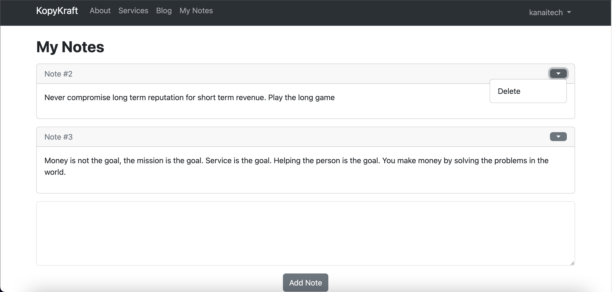

# Flask Blog Tutorial

In this project, we create a Blog using Flask, Flask-Login, and SQLAlchemy. Flask is a micro python web framework based on Werkzeug and Jinja 2. Basically, there are two types of web frameworks, Flask and Django. Flask is light weight, fun and easy to setup allowing flexiblity compared to Django. 

<p>
  
</p>

<p>
  
</p>

<p>
  
</p>

<p>
  
</p>

<p>
  
</p>

<p>
  
</p>

<p>
  
</p>

<p>
  
</p>

<p>
  <img 

**Setup Steps:**
```
1. mkdir flask_blog
2. cd flask_blog
3. pipenv shell
4. pipenv install flask flask-sqlalchemy flask-login
5. touch app.py
```

## 1. Flask Setup and Introduction

```
1. Prerequistics & Dependencies
2. Flask Setup
3. Flask Initialization
4. Running the Flask Web Server
5. Creating Views/Routes
6. Blueprints
7. Rendering HTML
8. Jinja Templating
9. Adding Bootstrap
10.Creating the Navbar
11.Creating the Login Page
12.Crating the Sign Up Page
```

```
# __init__.py

from flask import Flask, request, jsonify
from flask_sqlalchemy import SQLAlchemy
from flask_login import LoginManager
from os import path
from .models import db, DB_NAME, User
from .views import views # relative import
from .auth import auth 

def create_app():
    # Init app
    app = Flask(__name__)
    # configure secret key
    app.config['SECRET_KEY'] = 'flskblggr23'
    # Configure database
    app.config['SQLALCHEMY_DATABASE_URI'] = f'sqlite:///{DB_NAME}' 
    app.config['SQLALCHEMY_TRACK_MODIFICATIONS'] = False
    db.init_app(app)

    # setup database if it doesn't exist
    with app.app_context():
        db.create_all()

    # register blueprints
    app.register_blueprint(auth, url_prefix="")
    app.register_blueprint(views, url_prefix="")

    # set up flask login
    login_manager = LoginManager()
    login_manager.login_view = 'auth.login'
    login_manager.init_app(app)

    @login_manager.user_loader
    def load_user(id):
        return User.query.get(int(id))

    return app
```

```
# app.py
from website import create_app

# Run Server
if __name__ == '__main__':
    app = create_app()
    app.run(debug=True, port=2024)
```

## 2. User Authentication and Security

```
1. HTTP POST Method
2. Getting Form Data
3. SQLAlchemy Database Setup
4. Creating the User Model
5. Flask Login Setup
6. Creating a New User
7. Password Hashing
8. Logging In Users
9. Messaging Flash
10.Restricting Page Access
```

```
# project_name/website/auth.py
from flask import Blueprint, render_template, redirect, url_for, request, flash
from flask_login import login_user, logout_user, login_required, current_user
from werkzeug.security import generate_password_hash, check_password_hash
from .models import User
from . import db 

auth = Blueprint('auth', __name__)

#login page
@auth.route('/login', methods=['GET', 'POST'])
def login():
    if request.method == 'POST':
        email = request.form.get('email')
        password = request.form.get('password')

        # get user by email
        user = User.query.filter_by(email=email).first()
        if user:
            # user exists
            if check_password_hash(user.password, password):
                flash('Logged in successfully!', category='success')
                # login user and remember user until he/she clears session
                login_user(user, remember=True)
                return redirect(url_for('views.home', user=user))
            else:
                flash('Incorrect password, try again.', category='error')
        else:
            flash('Email does not exist.', catgory='error')
        
    return render_template('auth/login.html', user=current_user)


# sign up page
@auth.route('/sign-up', methods=['GET', 'POST'])
def sign_up():
    if request.method == 'POST':
        email = request.form.get('email')
        username = request.form.get('username')
        password1 = request.form.get('password1')
        password2 = request.form.get('password2')

        email_exists = User.query.filter_by(email=email).first()
        username_exists = User.query.filter_by(username=username).first()
        
        hashed_password = generate_password_hash(password1, method='sha256')

        if email_exists:
            flash('Email already exists', category='error')
        elif len(email_exists) < 4:
            flash('Email must be greater than 4 characters.', category='error')
        elif username_exists:
            flash('Username already exists', category='error')
        elif password1 != password2:
            flash('Passwords don\'t match', category='error')
        elif len(username) < 2:
            flash('Username is too short', category='error')
        elif len(password1) < 7:
            flash('Password mush be at least 7 characters.', category='error')
        # you could verify email here...
        else:
            user = User(email=email, username=username, password=hashed_password)
            db.session.add(user)
            db.session.commit()
            # login user and remember user
            login_user(user, remember=True)
            flash('Account created!', category='success')
            return redirect(url_for('views.home'))

    return render_template('auth/sign_up.html', user=current_user)

# logout route
@auth.route('/logout')
@login_required
def logout():
    logout_user()
    flash('Logged out successfully.', category='success')
    return redirect(url_for('views.home'))
```

## 3. Creating and Deleting Posts

```
1. Dynamic Navbar
2. Create Post Html
3. Post Database Model
4. Foreign Key Relationships
5. Creating a Post
6. Displaying a Posts
7. Delete Post Button
8. Delete Post View(Route)
9. Creating Some Buttons
10.View User Posts
```

```
# project_name/website/views.py

from flask import Blueprint, render_template, request, flash, redirect, url_for, jsonify
from flask_login import login_required, current_user
from .models import db, User, Post, Note, Comment, Like
import json

views = Blueprint('views', __name__)

# home page
@views.route('/')
@views.route('/home')
def home():
    return render_template('index.html')

# about page
@views.route('/about')
def about():
    return render_template('about.html')

# services page
@views.route('/services')
def services():
    return render_template('services.html')

# display blog posts
@views.route('/posts')
def blog_posts():
    posts = Post.query.all()
    return render_template('blog/posts.html', posts=posts)

# single post
@views.route('/posts/<string:id>')
def get_single_post(id):
    post = Post.query.filter_by(id=id).first()
    return render_template('blog/post.html', post=post)

# get author posts
@views.route('/posts/<username>')
@login_required
def author(username):
    user = User.query.filter_by(username=username).first()

    # check if user exists
    if not user:
        flash('No user with that username exists.', category='error')
        return redirect(url_for('views.home'))

    # get all posts by user
    # posts = Post.query.filter_by(author_id=user.id).all() # delete this cz it's expensive. we will have to make a new query to the db
    posts = user.posts

    return render_template('blog/author.html', posts=posts, username=username)

# delete post
@views.route('/delete-post/<id>')
@login_required
def delete_post(id):
    post = Post.query.filter_by(id=id).first()

    if not post:
        flash("Post does not exist.", category='error')
    elif current_user.id != post.id:
        flash('You do not have permission to delete this post.', category='error')
    else:
        db.session.delete(post)
        db.session.commit()
        flash('Post deleted successfully', category='success')
    
    return redirect(url_for('views.blog_posts'))

# dashboard view
@views.route('/dashboard')
@login_required
def dashboard():
    return render_template('home.html')

# create post route
@views.route('/create-post', methods=['GET', 'POST'])
@login_required
def create_post():
    if request.method == 'POST':
        title = request.form.get('title')
        content = request.form.get('content')

        if not content:
            flash('Post cannot be empty', category='error')
        else:
            post = Post(title=title, content=content, author=current_user)
            db.session.add(post)
            db.session.commit()
            flash('Post created!', category='success')
            return redirect(url_for('views.blog_posts'))

    return render_template('posts/create_post.html')

# Display All Notes
@views.route('/notes', methods=['GET', 'POST'])
@login_required
def notes():
    notes = Note.query.all()

    if request.method == 'POST':
        note = request.form.get('note')

        if len(note) < 1:
            flash('Note is too short!', category='error')
        else:
            new_note = Note(content=note, user_id=current_user.id)
            db.session.add(new_note)
            db.session.commit()
            flash('Note added!', category='success')

    return render_template('notes/index.html', notes=notes)

# delete note
@views.route('/delete-note/<int:id>')
@login_required
def delete_note(id):
    # note = json.loads(request.data)
    #  noteId = note['note']
    # note = Note.query.get(id)
    note = Note.query.filter_by(id=id).first()

    if not note:
        flash("Note does not exist.", category='error')
    elif current_user.id != note.user_id:
        flash('You do not have permission to delete this note.', category='error')
    else:
        db.session.delete(note)
        db.session.commit()
        flash('Note deleted successfully', category='success')
    
    return redirect(url_for('views.notes'))
    
    # return jsonify({})

```

## 4. Adding and Deleting Comments

```
1. Comment Database Model
2. Create Comment HTML
3. Create Comment View/Route
4. Displaying Comments
5. Delete Comment HTML
6. Delete Comment View/Route
```

```
# project_name/website/views.py
...

# post comment
@views.route('/create-comment/<post_id>', methods=['POST'])
@login_required
def create_comment(post_id):
    comment = request.form.get('comment')

    if not comment:
        flash('Comment cannot be empty', category='error')
    else:
        post = Post.query.filter_by(id=post_id)
        if post:
            comment = Comment(content=comment, post_id=post_id, author_id=current_user.id)
            db.session.add(comment)
            db.session.commit()
        else:
            flash('Post does not exist', category='error')

    return redirect(url_for('views.blog_posts'))

# delete comment
@views.route('/delete-comment/<comment_id>')
@login_required
def delete_comment(comment_id):
    comment = Comment.query.filter_by(id=comment_id).first()

    if not comment:
        flash('Comment does not exist.', category='error')
    elif current_user.id != comment.author_id and current_user.id != comment.post.author_id:
        flash('You do no have permission to delete this comment.', category='error')
    else:
        db.session.delete(comment)
        db.session.commit()

    return redirect(url_for('views.blog_posts'))

# like post
@views.route('/like-post/<post_id>', methods=['POST'])
@login_required
def like(post_id):
    post = Post.query.filter_by(id=post_id).first()
    like = Like.query.filter_by(author_id=current_user.id, post_id=post_id).first()

    if not post:
        # flash('Post does not exis.', category='error')
        return jsonify({'error': 'Post does not exist.'}, 400)
    elif like:
        db.session.delete(like)
        db.session.commit()
    else:
        like = Like(author_id=current_user.id, post_id=post_id)
        db.session.add(like)
        db.session.commit()

    # return redirect(url_for('views.blog_posts'))
    return jsonify({"likes": len(post.likes), "liked": current_user.id in map(lambda x: x.author, post.likes)})
```

## 5. Liking Posts

```
1. Like Database Model
2. Adding Fontawesome Icons
3. Like Counter
4. Like Post View/Route
5. Like Button
6. Avoiding Page Refresh with JS
```

```
# project_name/website/views.py
...

# like post
@views.route('/like-post/<post_id>', methods=['POST'])
@login_required
def like(post_id):
    post = Post.query.filter_by(id=post_id).first()
    like = Like.query.filter_by(author_id=current_user.id, post_id=post_id).first()

    if not post:
        # flash('Post does not exis.', category='error')
        return jsonify({'error': 'Post does not exist.'}, 400)
    elif like:
        db.session.delete(like)
        db.session.commit()
    else:
        like = Like(author_id=current_user.id, post_id=post_id)
        db.session.add(like)
        db.session.commit()

    # return redirect(url_for('views.blog_posts'))
    return jsonify({"likes": len(post.likes), "liked": current_user.id in map(lambda x: x.author, post.likes)})
```


## 6. Adding and Deleting Notes
Add the following code at the end of the views blueprint.

```
# project_name/website/views.py
...

# Display All Notes
@views.route('/notes', methods=['GET', 'POST'])
@login_required
def notes():
    notes = Note.query.all()

    if request.method == 'POST':
        note = request.form.get('note')

        if len(note) < 1:
            flash('Note is too short!', category='error')
        else:
            new_note = Note(content=note, user_id=current_user.id)
            db.session.add(new_note)
            db.session.commit()
            flash('Note added!', category='success')

    return render_template('notes/index.html', notes=notes)

# delete note
@views.route('/delete-note/<int:id>')
@login_required
def delete_note(id):
    # note = json.loads(request.data)
    #  noteId = note['note']
    # note = Note.query.get(id)
    note = Note.query.filter_by(id=id).first()

    if not note:
        flash("Note does not exist.", category='error')
    elif current_user.id != note.user_id:
        flash('You do not have permission to delete this note.', category='error')
    else:
        db.session.delete(note)
        db.session.commit()
        flash('Note deleted successfully', category='success')
    
    return redirect(url_for('views.notes'))
    
    # return jsonify({})
```

# Reference

1. [Flask Documentation](https://flask.palletsprojects.com/en/2.3.x/quickstart/)
2. [Flask SQLAlchemy Documentation](https://flask-sqlalchemy.palletsprojects.com/en/3.0.x/quickstart/)
3. [Flask Login Documentaion](https://flask-login.readthedocs.io/en/latest/)
4. [Flask Blog Tutorial: Tech With Tim - YouTube Series](https://www.youtube.com/watch?v=GQcM8wdduLI&list=PLzMcBGfZo4-nK0Pyubp7yIG0RdXp6zklu&index=1)